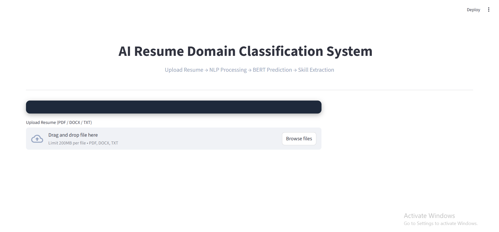
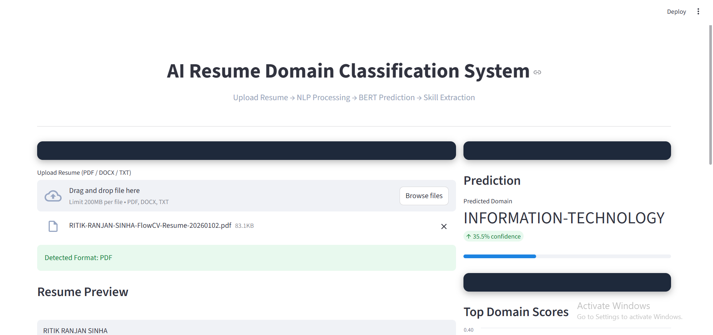

# Resume Domain Classification System (BERT)

BERT-based resume classifier with Streamlit UI.

## Features
- Resume upload (PDF/DOCX/TXT)
- Domain prediction (Top-3)
- Confidence score
- Skill extraction

## Run

pip install -r requirements.txt
streamlit run app.py

## Demo Screenshots

###  Upload Interface

### Prediction Output

## Model Download

Model is hosted externally due to GitHub size limits.
Download link: https://drive.google.com/file/d/1wjGs3yv8qiXBMPXatgmrlE_aeNVofLHu/view?usp=sharing
