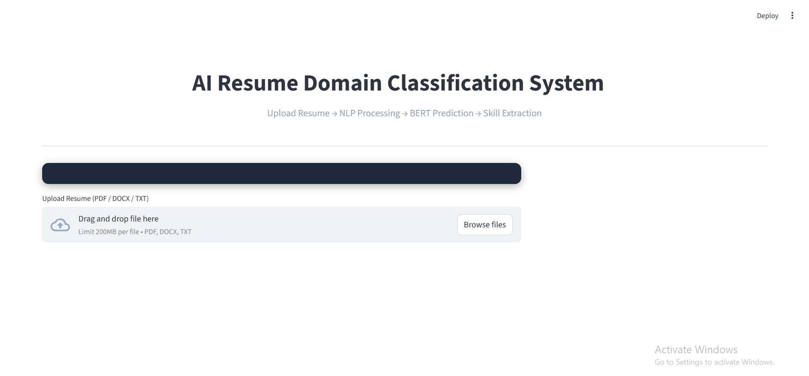
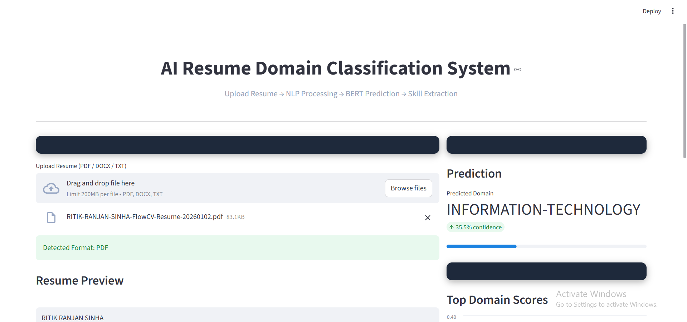

# Resume Domain Classification System (BERT)

BERT-based resume classifier with Streamlit UI.

## Features
- Resume upload (PDF/DOCX/TXT)
- Domain prediction (Top-3)
- Confidence score
- Skill extraction

## Run

pip install -r requirements.txt
streamlit run app.py

## Demo Screenshots

###  Upload Interface

### Prediction Output

## Model Comparison

To evaluate performance improvement, a classical machine learning baseline was implemented using Logistic Regression and compared against a fine-tuned BERT model.

###  Logistic Regression (TF-IDF + LR)

- Accuracy: **82.09%**
- Macro F1 Score: **0.79**
- Weighted F1 Score: **0.82**

###  Fine-Tuned BERT

- Accuracy: **86.75%**
- Macro F1 Score: **0.84**
- Weighted F1 Score: **0.86**

### Performance Summary

| Model | Accuracy | Macro F1 | Weighted F1 |
|-------|----------|----------|-------------|
| Logistic Regression | 82.09% | 0.79 | 0.82 |
| Fine-Tuned BERT | 86.75% | 0.84 | 0.86 |

### Observations

- BERT outperforms Logistic Regression across all evaluation metrics.
- Classical ML struggles with contextual understanding.
- Transformer-based BERT captures semantic meaning and improves generalization.
- Improvement of ~4.6% in accuracy demonstrates benefit of deep contextual embeddings.

## Model Download

Model is hosted externally due to GitHub size limits.
Download link: https://drive.google.com/file/d/1wjGs3yv8qiXBMPXatgmrlE_aeNVofLHu/view?usp=sharing
